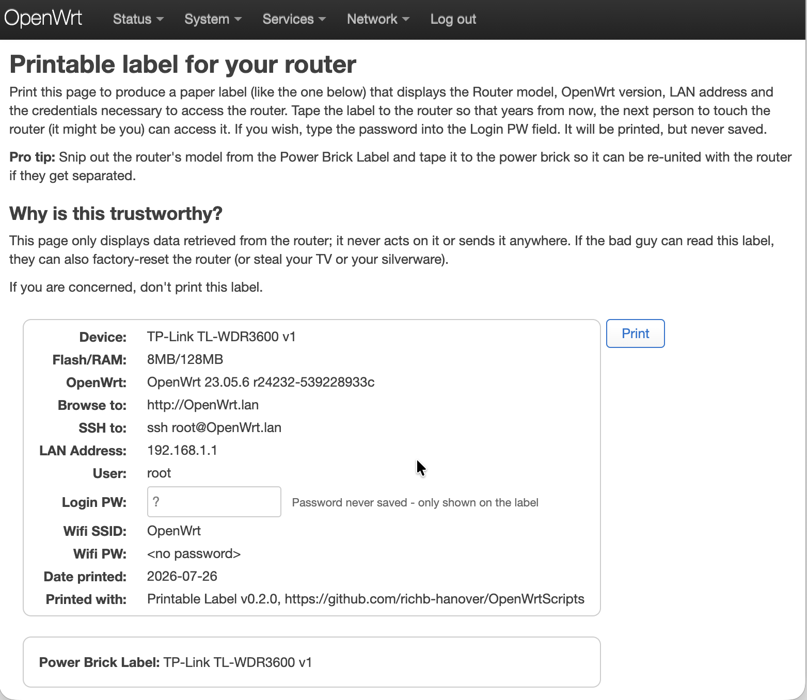

# Printable Label

This package displays a web page that, when printed,
creates a label with router info plus credentials
that can be taped to the router for ease of access
when you come back to the router years from now.

To display the label, choose **Services -> Printable Label**.
The outlined area (below) contains the information that
is printed on the label.

-------

The package displays the same information printed
by  `print-router-label.sh` (in the repo root).

The root login password can't be derived from
`uci`, so it's a plain text field on the page —
nothing typed there is saved to disk or sent to the router;
it only updates the page you're looking at.
